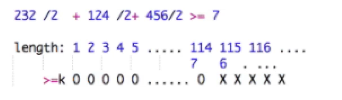

# 183. Wood Cut

# Description
Given n pieces of wood with length L[i] (integer array). Cut them into small pieces to guarantee you could have equal or more than k pieces with the same length. What is the longest length you can get from the n pieces of wood? Given L & k, return the maximum length of the small pieces.

You couldn't cut wood into float length.

If you couldn't get >= k pieces, return 0.

Have you met this question in a real interview?  
# Example
Example 1
```
Input:
L = [232, 124, 456]
k = 7
Output: 114
Explanation: sum([2, 1, 4]) = 7. We can cut it into 7 pieces if any piece is 114cm long, however we can't cut it into 7 pieces if any piece is 115cm long. 
```
Example 2
```
Input:
L = [1, 2, 3]
k = 7
Output: 0
Explanation: It is obvious we can't make it.
```
## Challenge
O(n log Len), where Len is the longest length of the wood.

## 思路
类似 Find last position of target


## Solution
```java
public class Solution {
    /**
     * @param L: Given n pieces of wood with length L[i]
     * @param k: An integer
     * @return: The maximum length of the small pieces
     */
    public int woodCut(int[] L, int k) {
        if (L == null || L.length == 0) {
            return 0;
        }
        
        int start = 1;
        int end = 0;
        for (int i = 0; i < L.length; i++) {  // O(n)
            end = Math.max(end, L[i]);  // set end to be the longest length of the wood
        }
        
        while (start + 1 < end) {  // O(logLen)
            int mid = start + (end - start) / 2;
            
            if (countWood(L, mid) >= k) {
                start = mid;
            } else {
                end = mid;
            }
        }
        
        if (countWood(L, end) >= k) {
            return end;
        }
        if (countWood(L, start) >= k) {
            return start;
        }
        return 0;
    }
    
    
    private int countWood(int[] L, int woodLen) {
        int count = 0;
        for (int i = 0; i < L.length; i++) {
            count += L[i] / woodLen;
        }
        return count;
    }

}
```